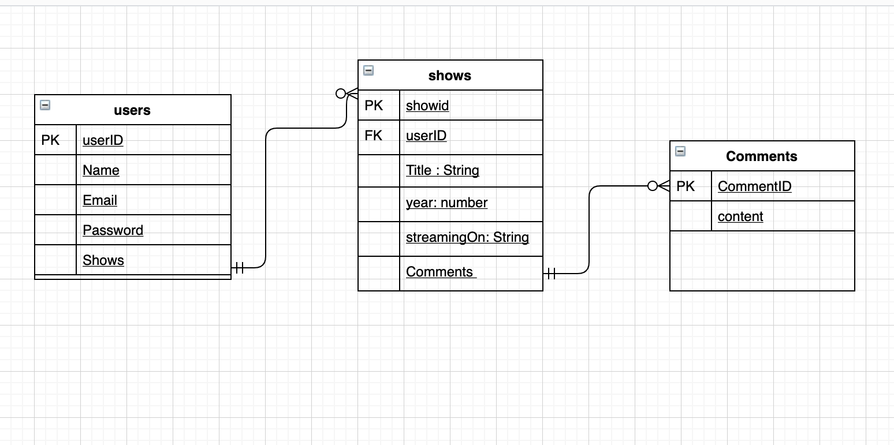

# `En-Tracker`: Start tracking your entertainment !

This is a personalised TV show tracking web app that allows users to add and delete their favorite TV shows and render that as a list sorted according to the network its aired on. The app is created using server-side rendering and I implemented this using node.js, express, EJS, mongoDB and Materialize. Access delegation was done through Google OAuth and to generate the different user pages, CRUD operations were utilised.Routers were set up for each request and views were rendered using EJS .To obtain the details of each TV show for my application I used the TMDB API.

## `Getting Started`: 
## The project planning started with creating a [Trello](https://trello.com/) board featuring all the user stories that this project would accomplish. Trello also enabled me to keep a track of the project progress.

 ## Next step was to create an Entity Relationship Diagram and wireframe using [draw.io](https://app.diagrams.net/). ERD determined the relationship between different entities - users , shows , comments . Intially I started with embedding show schema inside user schema and referencing the separate comments model within show schema however to avoid complications of retreiving data I embedded comments within show schema.
 

## Trello Board 

## Wireframe

## Entity Relationship Diagram (ERD)

# `En-Tracker Screenshot(s):` 
## Home Page 

## Googel OAuth

## Add Shows

## Show Details and Add Comments

## `Technologies Used: List of the technologies used.`
## This application was built using:
## - [node.js](https://nodejs.org/en/)
## - [Express](https://expressjs.com/)
## - Third Party API -[tmDB](https://www.themoviedb.org/)
## - request
## - EJS
## - Materialize

## Getting Started: The app has been deployed on Heroku and your Trello board with the project's planning.

# [En-Tracker](https://entracker.herokuapp.com/)

## `Planned future enhancements:`
 ## - Refactoring code to make the shows and comments available to different users at the same time.
 ## - Accessing not only TV shows but also movies from third party API.
 ## - Introducing additional feature such as when the users choose a genre of the show the page would render all shows of the      chosen genre.
 ## - Functionality the does not allow duplicates in the show list.
